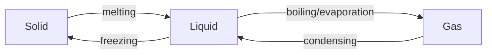

- [1 States of matter](#1-states-of-matter)
  - [1.1 Solids, liquids and gases](#11-solids-liquids-and-gases)
- [2 Atoms, elemenenter code herets and compounds](#2-atoms-elemenenter-code-herets-and-compounds)
  - [2.2 Atomic structure and the Periodic Table](#22-atomic-structure-and-the-periodic-table)
  - [2.4 - 2.7 Bonding](#24---27-bonding)
- [3 Stoichiometry](#3-stoichiometry)
  - [3.1 Formulae](#31-formulae)
    - [1 Formulae \<-\> Name](#1-formulae---name)
    - [2 molecular formula + 5 empirical formula](#2-molecular-formula--5-empirical-formula)
    - [3 6: Diagram -\> Simple Covalent/Ionic Compound](#3-6-diagram---simple-covalentionic-compound)
    - [4 7 8: Eqn](#4-7-8-eqn)
- [4 Electrochemistry](#4-electrochemistry)
  - [4.1 Electrolysis](#41-electrolysis)
    - [Definition](#definition)
- [5 Chemical energetics](#5-chemical-energetics)
  - [5.1 Exothermic and endothermic reactions](#51-exothermic-and-endothermic-reactions)
    - [Define](#define)
- [6 Chemical reactions](#6-chemical-reactions)
  - [6.2 Rate of reaction](#62-rate-of-reaction)
    - [Catalyst](#catalyst)
    - [Collision theory](#collision-theory)
  - [6.3 Reversible reactions and equilibrium](#63-reversible-reactions-and-equilibrium)
  - [6.4 Redox](#64-redox)
- [7 Acids, bases and salts](#7-acids-bases-and-salts)
  - [7.1 The characteristic properties of acids and bases](#71-the-characteristic-properties-of-acids-and-bases)
    - [Define](#define-1)
    - [Indicators](#indicators)
  - [7.3 Preparation of salts](#73-preparation-of-salts)
    - [solubility rule](#solubility-rule)
    - [Technique](#technique)
    - [Observation](#observation)
- [8 The Periodic Table](#8-the-periodic-table)
  - [8.4 Transition elements](#84-transition-elements)
- [9 Metals](#9-metals)
  - [9.1 Properties of metals](#91-properties-of-metals)
    - [Physical Properties](#physical-properties)
- [10 Chemistry of the environment](#10-chemistry-of-the-environment)
  - [10.3 Air quality and climate](#103-air-quality-and-climate)
    - [Photosynthesis](#photosynthesis)
- [11 Organic chemistry](#11-organic-chemistry)
  - [11.1 Formulae, functional groups and terminology](#111-formulae-functional-groups-and-terminology)
    - [Definition](#definition-1)
    - [Characteristics of members of a homologous series 家族成員之間特徵](#characteristics-of-members-of-a-homologous-series-家族成員之間特徵)
  - [11.2 Naming organic compounds](#112-naming-organic-compounds)
  - [11.4 Alkanes](#114-alkanes)
  - [11.5 Alkenes](#115-alkenes)
    - [Addition reaction](#addition-reaction)
  - [11.6 Alcohols](#116-alcohols)
    - [Methods of producing alcohols (for Ethanol)](#methods-of-producing-alcohols-for-ethanol)
  - [11.7 Carboxylic acids](#117-carboxylic-acids)
  - [11.8 Polymers](#118-polymers)
- [12 Experimental techniques and chemical analysis](#12-experimental-techniques-and-chemical-analysis)
  - [12.1 Experimental design](#121-experimental-design)

# 1 States of matter

## 1.1 Solids, liquids and gases

|         | Boiling               | evaporation                  |
| ------- | --------------------- | ---------------------------- |
| Happens | at specific temp.     | over a range of temperatures |
| Process | throughout the liquid | surface process              |
| Rate    | faster                | slower                       |

|             | Solid    | Liquid | Gas |   |
|-------------|----------|--------|-----|---|
| Separation  | Touching |        |     |   |
| Arrangement | Regular  |        |     |   |
| Motion      | Vibrate  |        |     |   |

# 2 Atoms, elemenenter code herets and compounds

## 2.2 Atomic structure and the Periodic Table

- Electronic Configuration
  - Outermost shell e
  - Number of e shell

## 2.4 - 2.7 Bonding
| Bond                 | Structure        | Bond Definition ( a strong electrostatic attraction between...) |
|----------------------|------------------|-----------------------------------------------------------------|
| Metallic             | Giant metallic   | Positive metal ions + "sea" of delocalized electrons            |
| Ionic                | Giant ionic      | Positive ions + Negative ions                                   |
| Covalent             | Giant covalent   | Positive nuclei + Negative shared electrons                     |
| Intermolecular force | Simple molecular |                                                                 |

- Melting point
  1. (**Simple / Giant**) Structure? 
  2. It has (**Weak / Strong**) ______ Bond between (**molecules / + -**)
  3. (**Less / A lot of energy**) is needed to overcome the (**Weak / Strong**)  ______ bond.
# 3 Stoichiometry

## 3.1 Formulae

### 1 Formulae <-> Name

### 2 molecular formula + 5 empirical formula

畫龜背 --> Empirical formula X --> Molecular Formula Y ($nX = M_r$)

### 3 6: Diagram -> Simple Covalent/Ionic Compound

### 4 7 8: Eqn

- Word Eqn (chemical name)
- Symbol Eqn (chemical formula)
  - State symbol: s l g aq
  - Ionic Eqn + State

- Balance Eqn
  - 計數法

# 4 Electrochemistry
## 4.1 Electrolysis
### Definition

| **Term**              | **Definition**                                                |
|-----------------------|---------------------------------------------------------------|
| **Electrolysis** | **Breakdown** of an **ionic compound** in **molten or aqueous** state   by **electricity**|

>Q:
> Why use graphite as electrode
>
>A:
> Graphite is insert
> Graphite conduct electricity

# 5 Chemical energetics

## 5.1 Exothermic and endothermic reactions

### Define

| **Term**              | **Definition**                                                |
|-----------------------|---------------------------------------------------------------|
| **Activation Energy** | the minimum energy required that colliding particles to react |

# 6 Chemical reactions

## 6.2 Rate of reaction

> Q: State how the shape of the graph shows that the rate of reaction decreases as the reaction progresses.
> A: gradient/slope decreases

### Catalyst
Definition: Catalyst
: increases the rate of a reaction & unchanged at the end of a reaction

### Collision theory

| **Effect**              | **null**                                 | **null**                | **null**                       |
|-------------------------|------------------------------------------|-------------------------|--------------------------------|
| **↑ Concentration []** | ↑ more #particles per unit volume        |                         | ↑ more frequent collision rate |
| **↑ Temperature**       | ↑ avg KE of particles                    | ↑ more #particles >= Ea | ↑ more frequent collision rate |
| **↑ Pressure**         | ↑ more #particles per unit volume        |                         | ↑ more frequent collision rate |
| **↑ Surface area**      | ↑ more reactant expose to collide        |                         |                                |
| **↑ Catalyst**          | It provide another pathway with lower Ea | ↑ more #particles >= Ea |                                |

- ↑ increase successful collisions (per unit time)/(rate)
- ↑ increase reaction rate

## 6.3 Reversible reactions and equilibrium

Haber Process:
N2 : Air
Hydrogen: Methane with Steam 合成氣工藝

Contact Process:
O2: Air
SO2: Burning sulfur or roasting sulfide ores

|                | **Haber Process**        | **Contact Process**       |
|----------------|--------------------------|---------------------------|
| **Symbol Eqn** | N2(g) + 3H2(g) ⇌ 2NH3(g) | 2SO2(g) + O2(g) ⇌ 2SO3(g) |
| **Temp**       | 450°C                    | 450°C                     |
| **Pressure**   | 200atm                   | 2atm                      |
| **Catalyst**   | Fe, iron                 | VO5, vanadium(V) oxide    |
| **Detla H**    | Exothermic               | Exothermic                |

safety considerations and economics

## 6.4 Redox

| **Oxidation** | **Reduction** |
|:-------------:|:-------------:|
| + O           | - O           |
| + O.N.        | - O.N.        |
| - e           | + e           |
| - H           | + H           |

# 7 Acids, bases and salts

## 7.1 The characteristic properties of acids and bases

### Define

| **Term**        | **Definition**                                             | **null**                           |
|-----------------|------------------------------------------------------------|------------------------------------|
| **Acid**        | Proton donors                                              |                                    |
| **Base**        | Proton acceptors                                           |                                    |
| **Strong Acid** | An acid that is completely dissociated in aqueous solution | HCl(aq) → H+(aq) + Cl–(aq)         |
| **Weak Acid**   | An acid that is partially dissociated in aqueous solution  | CH3COOH(aq) ⇌ H+(aq) + CH3COO–(aq) |

### Indicators

| **Indicator**           | **Acid**   | **Neutral**    | **Alkali**    |
|-------------------------|------------|----------------|---------------|
| **Litmus 石蕊**           |  Red       |                | Blue          |
| **thymolphthalein**     | Colourless |                | Blue          |
| **methyl orange**       | Red        |                | Yellow        |
| **Universal Indicator** | Red        | Green          | Blue (Purple) |
| **null**                |            |                |               |
| **phenolphthalein**     | Colourless | Very pale pink | Pink          |

- Litmus is not suitable for titrations
    > as the colour change is not sharp ==> Difficult to determine an endpoint

## 7.3 Preparation of salts

### solubility rule

| Soluble            | Insoluble             |
|--------------------|-----------------------|
| Gp 1, NH4+         | CO32-                 |
| NO3-               | OH- (Ca(OH)2 partial) |
| Cl- (Ag, Pb)       |                       |
| SO42- (Ba, Ca, Pb) |                       |

### Technique

- Why it is important to add excess XXX?

> To use up all acid / To ensure complete reaction that used up all "reactant B"

### Observation

- fizzing
- stops dissolving/ Solid remains

# 8 The Periodic Table

## 8.4 Transition elements

- form coloured compounds / ions
- act as catalysts

# 9 Metals

## 9.1 Properties of metals

### Physical Properties

1 Compare the general physical properties of
metals and non-metals, including:
(a) thermal conductivity
(b) electrical conductivity
(c) malleability and ductility
(d) melting points and boiling points
2 Describe the general chemical properties of
metals, limited to their reactions with:
(a) dilute acids
(b) cold water and steam
what makes alkaline hydroxide OR OH–

(c) oxygen

# 10 Chemistry of the environment
## 10.3 Air quality and climate 
### Photosynthesis

- carbon dioxide + water → glucose + oxygen
- 6CO2 + 6H2O → C6H12O6 + 6O2

# 11 Organic chemistry

## 11.1 Formulae, functional groups and terminology

### Definition
| **Term**                  | **Description**                                                                         |
|---------------------------|-----------------------------------------------------------------------------------------|
| **Functional Group**      | an **atom or group of atoms** that **determine the chemical properties** of a homologous series |
| **Structural Isomers**    | compounds with the **same molecular formula** but **different structural formula**              |
| **Saturated Compounds**   | molecules in which **all** carbon-carbon bonds are **single bonds**                             |
| **Unsaturated Compounds** | molecules in which **one or more** carbon-carbon bonds are **not single**                       |

(a) alkanes, CnH2n+2
(b) alkenes, CnH2n
(c) alcohols, CnH2n+1OH
(d) carboxylic acids, CnH2n+1COOH

###  Characteristics of members of a homologous series 家族成員之間特徵
1. having the **same functional group**
2. having the **same general formula**
3. **differing** from one member to the next by a **–CH2– unit**
4. displaying a **trend in physical properties**
5. sharing **similar chemical properties**

## 11.2 Naming organic compounds
| **# of C** | **Stem** | **Alkane (-ane)** | **Alkene (-ene)** | **Alcohol (-ol)** | **Carboxylic acids (-noic acid)** |
|------------|----------|-------------------|-------------------|-------------------|-----------------------------------|
| 1          | meth     | methane           | methene           | methanol          | methanoic acid                    |
| 2          | eth      | ethane            | ethene            | ethanol           | ethanoic acid                     |
| 3          | prop     | propane           | propene           | propanol          | propanoic acid                    |
| 4          | but      |                   |                   |                   |                                   |
| 5          | pent     |                   |                   |                   |                                   |
| 6          | hex      |                   |                   |                   |                                   |
| 7          | hept     |                   |                   |                   |                                   |
| 8          | oct      |                   |                   |                   |                                   |
| 9          | non      |                   |                   |                   |                                   |
| 10         | dec      |                   |                   |                   |                                   |

## 11.4 Alkanes

## 11.5 Alkenes
- **unsaturated** hydrocarbons

### Addition reaction
|                              | Alkene to ...     |  Add what | Remarks                     |
|------------------------------|-------------------|-----------|-----------------------------|
| **Bromine**                  | 1,2-dibromoethane | -Br  -Br    | Test for saturation         |
| **Steam (hydration)**        | ethanol           | -H   -OH    | **300°C, 60atm, acid** catalyst |
| **hydrogen (hydrogenation)** | ethane            | -H   -H     | **200°C, nickel** catalyst      |

>Q: 
>How to distinguish between saturated and unsaturated hydrocarbons?
>
>A: 
>Using **Bromine water** (orange-brown):
>- **Saturated**: remains orange (unreactive)
>- **Unsaturated**: turns from orange to colourless / decolourises

>Q:
> Why stage one is called an **addition reaction**.
>
>A:
> Only form one product

## 11.6 Alcohols

### Methods of producing alcohols (for Ethanol)
<table>
    <tr>
        <td> </td>
        <td>Fermentation of Aqueous Glucose (for Ethanol)</td>
        <td>Catalytic Addition of Steam to Ethene </td>
    </tr>
    <tr>
        <td>Describe</td>
        <td>Yeast is added to dissolved glucose.</td>
        <td>The ethene reacts with steam (reversibly) to form ethanol</td>
    </tr>
    <tr>
        <td>Reaction</td>
        <td>C6H12O6 → 2C2H5OH + 2CO2</td>
        <td>ethene (g) + steam (g) ⇌ ethanol (l)</td>
    </tr>
    <tr>
        <td>Condition</td>
        <td>25-35 °C for optimal enzyme activity</td>
        <td>300°C, 60 atm, acid Catalyst - phosphoric acid</td>
    </tr>
    <tr>
        <td> </td>
        <td> </td>
        <td> 
          Low temp: Gives better yield
           
          High temp: Faster rate
        </td>
    </tr>
    <tr>
        <td>Rate</td>
        <td>The slow reaction produces a dilute solution that requires processing. Can only be produced in batches</td>
        <td>The fast reaction produces pure ethanol. Continuous production (no batches) </td>
    </tr>
    <tr>
        <td>Green 1</td>
        <td>Produces greenhouse gas (CO2)</td>
        <td>No greenhouse pollutants </td>
    </tr>
    <tr>
        <td>Green 2</td>
        <td>Uses renewable resources</td>
        <td>Uses non-renewable resources (crude oil)</td>
    </tr>
</table>

## 11.7 Carboxylic acids

## 11.8 Polymers

# 12 Experimental techniques and chemical analysis

## 12.1 Experimental design

| **Term**           | **Description**                                                                             | **null** |
|--------------------|---------------------------------------------------------------------------------------------|----------|
| Solvent            | A substance that dissolves a solute                                                         | 糖 鹽 粉 |
| Solute             | A substance that is dissolved in a solvent                                                  | 水 牛奶  |
| Solution           | A mixture of one or more solutes dissolved in a solvent                                     | 糖鹽水   |
| Saturated solution | A solution that can hold no more solute at the specified temperature                        |          |
|                    |                                                                                             |          |
| Residue            | A substance that remains after evaporation, distillation, filtration or any similar process |          |
| Filtrate           | A liquid or solution that has passed through a filter                                       |          |
